<<<<<<< HEAD
# price-search-engine
基于python爬虫的价格搜索引擎实现
=======

Elasticsearch安装及教程
1、[ES下载地址](https://www.elastic.co/cn/downloads/elasticsearch)，安装前确认安装 java1，下载后无需安装，只需解压即可

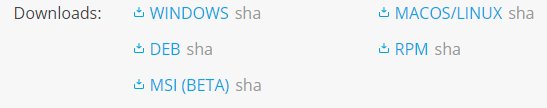

2、cmd 进入解压后的文件， 运行bin文件夹中的“elasticsearch.bit”文件，

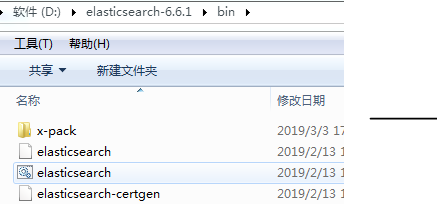

3、安装过程：

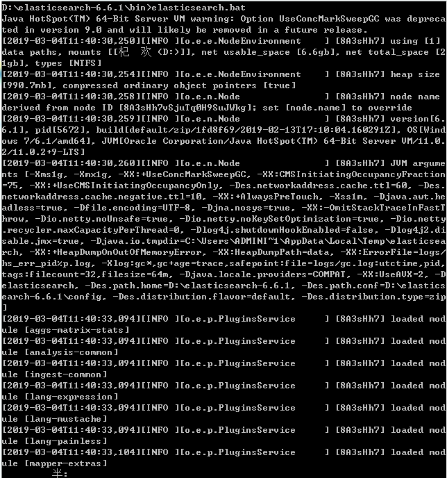

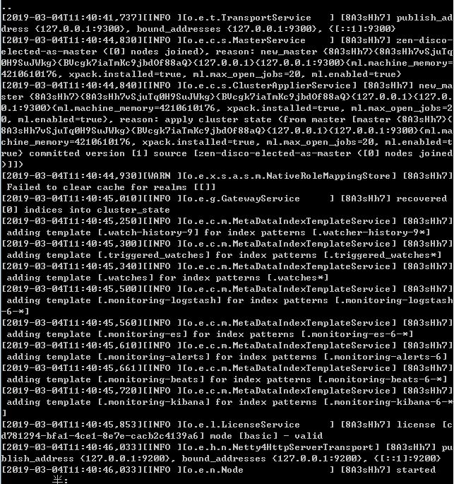

4、安装后在浏览器登入“localhost：9200”，若出现如下提示则安装成功

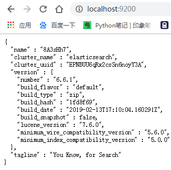

5、安装 elasticsearch-head插件

elasticsearch-head下载安装：
```
git clone git://github.com/mobz/elasticsearch-head.git
cd elasticsearch-head
```

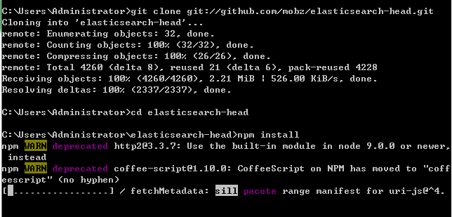

* npm install

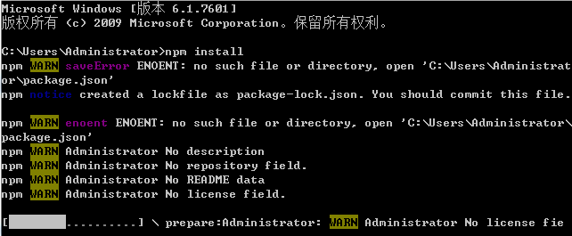


* 安装grunt，输入 :

```
&quot;npm install -g grunt --registry=https://registry.npm.taobao.org
```
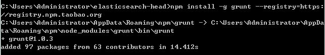

* 运行 grunt server，出现如下错误

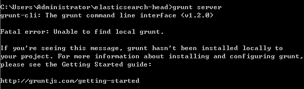

* npm run start运行出现错误，

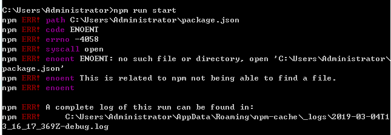

* 输入 " npm install phantomjs-prebuilt@2.1.16 --ignore-scripts"

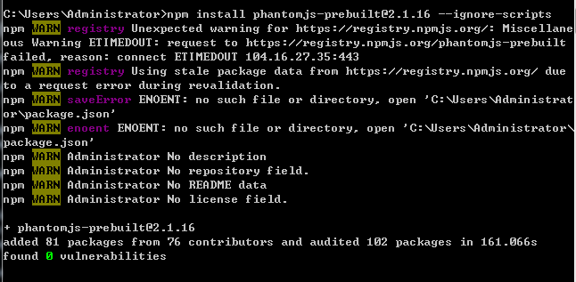

重启后再次运行 npm run start，出现如下错误

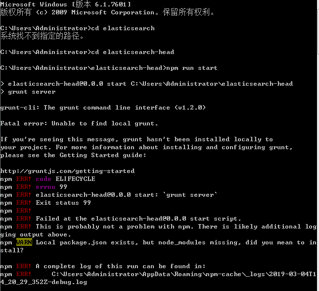

* 在elasticsearch-head/node_modules路径中安装grunt的二进制文件，输入“npm install grunt --save”

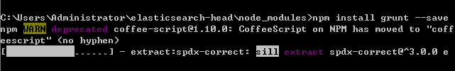

* npm运行成功

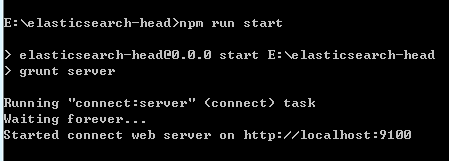

* 打开浏览器进入：“localhost：9100”，显示如下画面，则安装成功

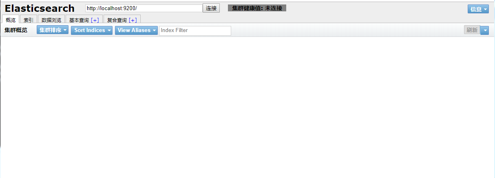

* 配置elasticsearch的环境变量打开elasticsearch-6.6.1/config/elasticsearch.yml,添加一下内容并保存

```
# 是否支持跨域 http.cors.enabled: true#
* 表示支持所有域名 http.cors.allow-origin: &quot;*&quot;
``` 
6、安装elasticsearch-rtf插件
```
git clone git：//github.com/medcl/elasticsearch-rtf.git -b master --depth 1
```

进入elasticsearch安装目录下的/bin/elasticsearch.bat
安装成功后重启elasticsearch即可使用

7、index添加与删除
* 添加：
 curl -X PUT "http://localhost:9200/weather"


* 删除
curl -X DELETE "http://localhost:9200/weather"


8、查看当前所有的Index

```
curl -X GET "http://localhost:9200/_cat/indices?v"
```


9、分词组件
* Ik分词器

[IK分词器下载地址](https://github.com/medcl/elasticsearch-analysis-ik/releases)

>根据ES版本下载对应版本的IK

* 安装完成后下载后将解压的文件放入/elasticsearch/plugins路径下，并将文件名更改为analysis-ik ，以及其中的config文件夹复制进/elasticsearch/config文件夹中 并将文件夹名改为 ik。
>>>>>>> how to use ES
